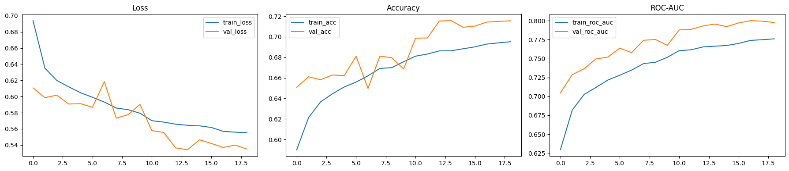
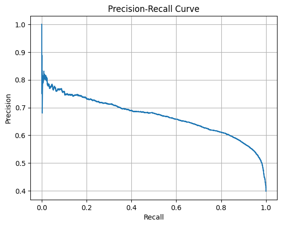
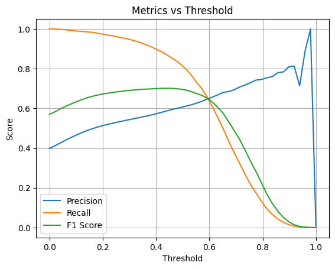
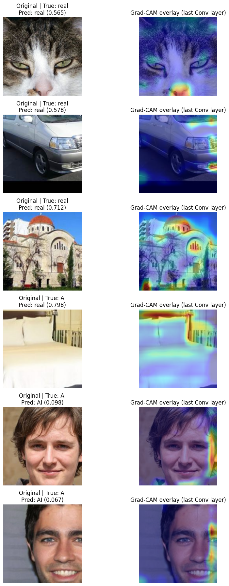
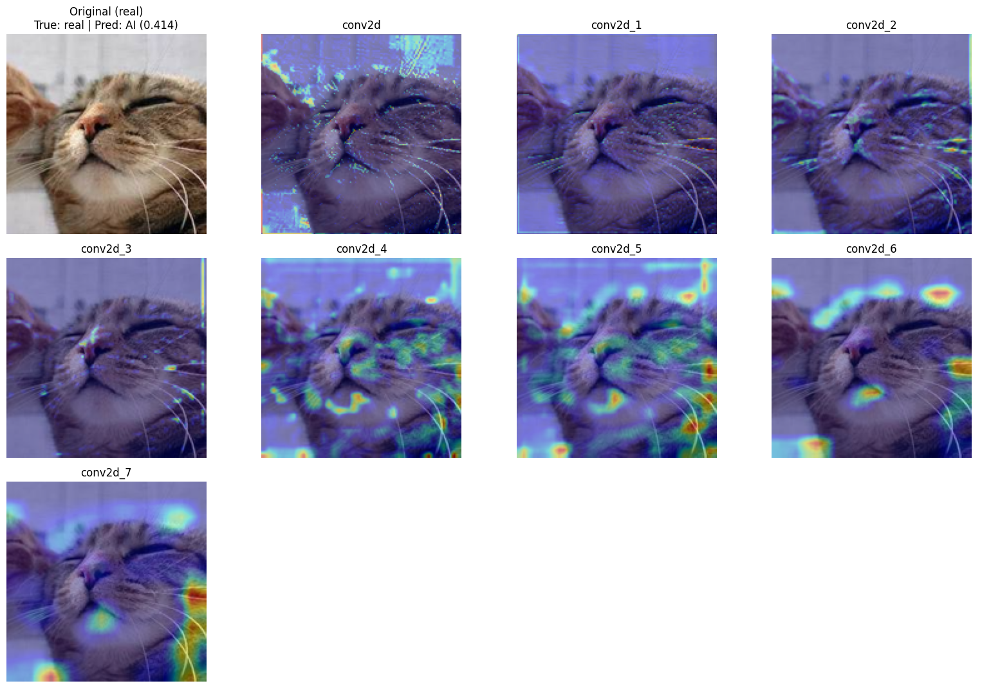
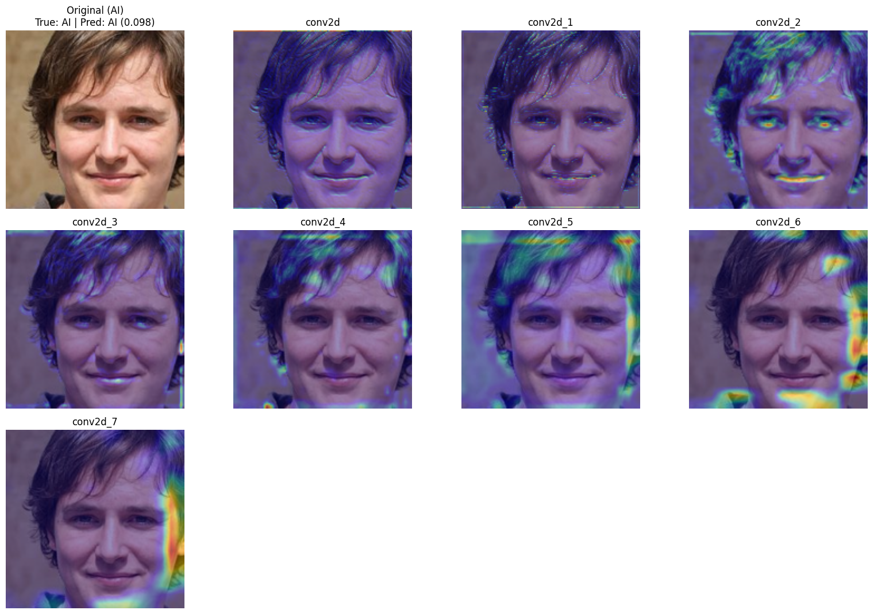

# CNN Benchmark (Basic): AI vs Real Image Classification

This report documents the full experiment in `ippr_project/cnn_benchmark_basic-1.ipynb` for binary image classification:
- `0 = fake (AI-generated)`
- `1 = real`

Dataset:
- Hugging Face: `ShreyashDhoot/AI_vs_Real`

---

## 1) Experiment Objective

Build a compact but deep CNN baseline that:
- trains on a large AI-vs-real dataset,
- reports imbalance-aware metrics,
- performs threshold tuning (instead of relying only on 0.5),
- and provides visual explanations using Grad-CAM.

---

## 2) Environment and Runtime

Observed in notebook output:
- TensorFlow version: `2.18.0`
- GPUs detected: `2`

Primary libraries used:
- `tensorflow`
- `numpy`
- `matplotlib`
- `scikit-learn`
- `datasets`
- `huggingface_hub`

---

## 3) Dataset and Split Details

Loaded from Hugging Face, then split in-notebook using `train_test_split`:

| Split | Samples |
|---|---:|
| Train | 144,381 |
| Validation | 18,048 |
| Test | 18,048 |

Label mapping:
- `0 -> fake`
- `1 -> real`

### Training Class Distribution

| Class | Count |
|---|---:|
| fake | 86,393 |
| real | 57,988 |

Class weights computed from the train split:
- fake (0): `0.8356`
- real (1): `1.2449`

Interpretation:
- The `real` class is the minority class, so it receives a higher weight to reduce bias toward `fake`.

---

## 4) Input Pipeline and Preprocessing

- Images converted to RGB and resized to `160 x 160`.
- `tf.data` used with shuffle, batch, and prefetch.
- Batch size: `8`

Data augmentation in-model:
- random horizontal flip,
- random rotation (`0.12`),
- random zoom (`0.15`),
- random contrast (`0.15`).

---

## 5) Model Architecture

Model name: `deep_dense_cnn`

Input and output:
- Input: `(160, 160, 3)`
- Output: sigmoid scalar (`P(real)`)

### Architecture Summary

| Stage | Details |
|---|---|
| Stem | Rescaling `1/255` |
| Block 1 | Conv(16) -> BN -> Conv(16) -> BN -> MaxPool -> Dropout(0.20) |
| Block 2 | Conv(32) -> BN -> Conv(32) -> BN -> MaxPool -> Dropout(0.25) |
| Block 3 | Conv(64) -> BN -> Conv(64) -> BN -> MaxPool -> Dropout(0.30) |
| Block 4 | Conv(128) -> BN -> Conv(128) -> BN -> MaxPool -> Dropout(0.35) |
| Head | GAP -> Dense(128) + BN + Dropout(0.40) -> Dense(64) + BN + Dropout(0.30) -> Dense(1, sigmoid) |

Parameter counts:

| Type | Count |
|---|---:|
| Total params | 321,041 |
| Trainable params | 319,697 |
| Non-trainable params | 1,344 |

---

## 6) Training Configuration

- Epochs configured: `20`
- Optimizer: `Adam(learning_rate=1e-4)`
- Loss: `binary_crossentropy`
- Metrics tracked: accuracy, precision, recall, ROC-AUC, PR-AUC
- Callbacks:
  - `EarlyStopping(monitor='val_loss', patience=5, restore_best_weights=True)`
  - `ReduceLROnPlateau(monitor='val_loss', factor=0.3, patience=2, min_lr=1e-7)`

### Learning-Rate Events

- LR reduced at epoch `10` to `3e-5`
- LR reduced at epoch `16` to `9e-6`
- LR reduced at epoch `18` to `2.7e-6`
- Early stopping triggered at epoch `19`
- Best weights restored from epoch `14`

---

## 7) Training Curves

The notebook plots loss, accuracy, and ROC-AUC trends over epochs.

Observations:
- Validation metrics improve steadily through the mid-epochs.
- Late training shows diminishing returns, matching the early-stopping behavior.

---

## 8) Final Test Results (Threshold = 0.5)

### Aggregate Metrics

| Metric | Value |
|---|---:|
| Accuracy | 0.7168 |
| Precision (real) | 0.6080 |
| Recall (real) | 0.8149 |
| F1-score (real) | 0.6964 |
| Balanced Accuracy | 0.7333 |
| ROC-AUC | 0.7978 |
| PR-AUC | 0.6690 |
| MCC | 0.4580 |
| Specificity | 0.6517 |
| Sensitivity | 0.8149 |
| NPV | 0.8415 |
| FPR | 0.3483 |
| FNR | 0.1851 |

### Confusion Matrix

`[[TN, FP], [FN, TP]] = [[7072, 3780], [1332, 5864]]`

| Actual \ Predicted | Fake (0) | Real (1) |
|---|---:|---:|
| Fake (0) | 7072 | 3780 |
| Real (1) | 1332 | 5864 |

### Class-wise Classification Report

| Class | Precision | Recall | F1-score | Support |
|---|---:|---:|---:|---:|
| fake | 0.8415 | 0.6517 | 0.7345 | 10,852 |
| real | 0.6080 | 0.8149 | 0.6964 | 7,196 |
| macro avg | 0.7248 | 0.7333 | 0.7155 | 18,048 |
| weighted avg | 0.7484 | 0.7168 | 0.7193 | 18,048 |

Interpretation:
- The model is recall-oriented for `real` images (high recall, moderate precision).
- This implies more `fake -> real` false positives than ideal for strict forensic use.

---

## 9) Precision-Recall and Threshold Analysis

### Precision-Recall Curve

### Metrics vs Threshold

Best threshold by F1 from sweep:
- Best threshold: `0.429`
- Precision: `0.5830`
- Recall: `0.8797`
- F1: `0.7012`

Confusion matrix at threshold `0.429`:
- `[[6324, 4528], [866, 6330]]`

Comparison (`t=0.5` vs `t=0.429`):
- Lowering threshold increases recall for `real` predictions.
- It also increases false positives (`fake` misclassified as `real`).
- For recall-critical workflows, `0.429` may be preferable.
- For precision-critical workflows, keep threshold higher and/or calibrate further.

---

## 10) Inference and Explainability (Grad-CAM)

The inference section loads a saved model (`.keras`) or falls back to rebuilding + loading `.weights.h5` if needed.

Saved model artifact (from notebook output):
- `/kaggle/working/deep_dense_cnn_ai_vs_real.keras`

Grad-CAM target information:
- Last conv layer used: `conv2d_7`
- Conv layers available for per-layer analysis:
  - `conv2d`, `conv2d_1`, `conv2d_2`, `conv2d_3`, `conv2d_4`, `conv2d_5`, `conv2d_6`, `conv2d_7`

### 3 Real + 3 AI Samples with Last-Layer Grad-CAM

### Per-Layer Grad-CAM for One Real Sample

### Per-Layer Grad-CAM for One AI Sample

Interpretability notes:
- Later conv layers (especially `conv2d_6` and `conv2d_7`) provide more semantically focused heatmaps.
- Early conv layers tend to activate on edges/textures and are less class-discriminative.

---

## 11) Key Observations and Discussion

1. The model achieves useful ranking quality (`ROC-AUC 0.7978`, `PR-AUC 0.6690`) with a relatively small parameter budget.
2. Recall for `real` is strong, indicating sensitivity to real-image cues.
3. Precision for `real` is lower, indicating a substantial false-positive cost when predicting real.
4. Threshold tuning is necessary; fixed `0.5` is not always optimal for the target objective.
5. Grad-CAM shows that final convolutional features capture class-relevant regions more clearly than early layers.

---

## 12) Known Warnings During Training

Two warnings/messages were observed in logs:
- A TensorFlow layout optimizer warning (`INVALID_ARGUMENT`) appeared once in early training.
- A dataset exhaustion warning (`Your input ran out of data`) appeared during epoch 1 logs.

Despite these messages, training proceeded, validation improved, and final evaluation completed with stable metrics.

---

## 13) Reproducibility Notes

Fixed settings used:
- Seed: `42`
- Image size: `160 x 160`
- Batch size: `8`
- Epoch cap: `20`
- Initial LR: `1e-4`

To reproduce:
1. Open `ippr_project/cnn_benchmark_basic-1.ipynb`.
2. Run cells top-to-bottom.
3. Ensure Hugging Face dataset access is configured if required.
4. Re-run evaluation and threshold cells to regenerate metrics/plots.

---

## 14) Suggested Next Experiments

1. Replace BCE with focal loss to reduce easy-negative dominance and improve minority-class discrimination.
2. Add stronger regularization or mixup/cutmix to improve precision without sacrificing much recall.
3. Calibrate probabilities (temperature scaling / Platt scaling) before threshold selection.
4. Compare with transfer-learning backbones (EfficientNet, ConvNeXt-Tiny) under identical split/metric protocol.
5. Add external-domain test sets to validate robustness across generators and cameras.
