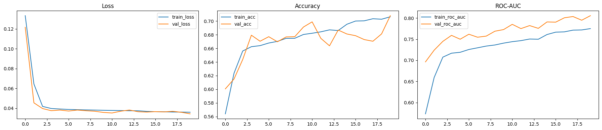
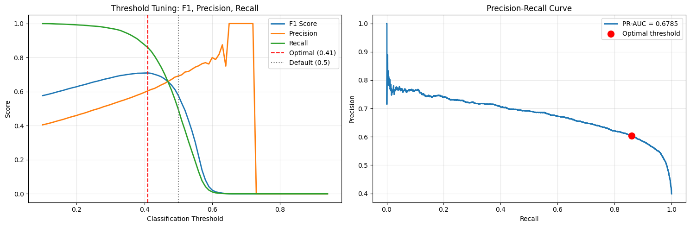
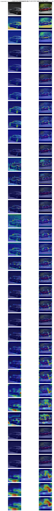

# AI-generated vs Real Image Classification with Focal Loss

## Overview

This notebook implements a deep Convolutional Neural Network (CNN) with residual connections and Focal Loss to classify images as either **AI-generated or real**. The model is designed specifically to handle class imbalance, a critical challenge in this binary classification task where real and AI-generated images may not be evenly distributed in the dataset.

---

## Dataset Information

### Dataset Source
- **Repository**: [ShreyashDhoot/AI_vs_Real](https://huggingface.co/datasets/ShreyashDhoot/AI_vs_Real)
- **Platform**: Hugging Face Hub
- **Schema**:
  - `image`: Image data (PIL format, converted to RGB and resized to 160×160)
  - `label`: Binary labels (0 = AI-generated/fake, 1 = Real)

### Data Splits
The dataset is split into three partitions:
- **Training Set**: 80% of data (for model training with augmentation)
- **Validation Set**: 10% of data (for hyperparameter tuning and early stopping)
- **Test Set**: 10% of data (for final model evaluation)

### Class Imbalance Analysis
The notebook computes class distribution and weights to address imbalance:
- Class weights are automatically calculated based on class frequencies
- Imbalance ratio metric (real/fake ratio) is computed to quantify disparity
- Class weights are applied during training to penalize minority class misclassifications

### Image Preprocessing

**Training Set Augmentation:**
- Normalization: Convert to float32 and divide by 255.0
- Random horizontal flipping
- Random brightness adjustment (max_delta=0.10)
- Random contrast adjustment (range 0.90-1.10)
- Clipping to [0.0, 1.0] range

**Validation & Test Sets:**
- Normalization: Convert to float32 and divide by 255.0
- No augmentation applied

**Image Specifications:**
- Height: 160 pixels
- Width: 160 pixels
- Channels: 3 (RGB)
- Batch Size: 8

---

## Architecture

### Model: Residual CNN with Focal Loss

The model is a deep CNN with **4 residual blocks** followed by a dense classification head. Residual connections enable better gradient flow through deep networks.

#### Architecture Diagram


The architecture consists of:

**Input**: (None, 160 × 160 × 3)

**Block 1 — Plain Conv (16 ch)**
- Conv(3→16, 3×3) + BatchNorm
- Conv(16→16, 3×3) + BatchNorm + ReLU  
- MaxPooling/2 + Dropout(0.25)
- Output: (None, 80 × 80 × 16)

**Block 2 — Residual (32 ch)**
- Conv(16→32, 3×3) + BatchNorm
- Conv(32→32, 3×3) + BatchNorm
- Residual connection with Conv(1×1, 16→32) shortcut
- ReLU + MaxPooling/2 + Dropout(0.3)
- Output: (None, 40 × 40 × 32)

**Block 3 — Residual (64 ch)**
- Conv(32→64, 3×3) + BatchNorm
- Conv(64→64, 3×3) + BatchNorm
- Residual connection with Conv(1×1, 32→64) shortcut
- ReLU + MaxPooling/2 + Dropout(0.35)
- Output: (None, 20 × 20 × 64)

**Block 4 — Residual (128 ch)**
- Conv(64→128, 3×3) + BatchNorm
- Conv(128→128, 3×3) + BatchNorm
- Residual connection with Conv(1×1, 64→128) shortcut
- ReLU + MaxPooling/2 + Dropout(0.4)
- Output: (None, 10 × 10 × 128)

**Classification Head**
- GlobalAveragePooling2D → (None, 128)
- Dense(128) + BatchNorm + Dropout(0.45) → (None, 128)
- Dense(64) + BatchNorm + Dropout(0.35) → (None, 64)
- Dense(1, Sigmoid) → (None, 1)

**Loss Function**: Focal Loss (γ = 2.0) for binary classification

### Key Components

1. **Convolutional Blocks**:
   - 3×3 convolutions with "same" padding in each block
   - L2 regularization (λ=1e-4) on all convolutional layers
   - Batch Normalization after convolutions for stable training
   - ReLU activation (applied after residual add)

2. **Residual Connections**:
   - Added after Blocks 2, 3, and 4
   - 1×1 convolution for dimension matching when needed
   - Enable gradient flow through deeper layers

3. **Spatial Reduction**:
   - MaxPooling2D with default 2×2 window and 2 stride
   - Reduces spatial dimensions progressively

4. **Dropout Regularization**:
   - Increasing rates from 0.25 (early layers) to 0.4 (late conv layers)
   - Additional dropout in dense layers (0.45 and 0.35)
   - Prevents overfitting on the training set

5. **Dense Head**:
   - Global Average Pooling to collapse spatial dimensions
   - 128-unit dense layer with ReLU and BatchNorm
   - 64-unit dense layer with ReLU and BatchNorm
   - Single sigmoid output for binary classification

### Loss Function: Focal Loss

Standard cross-entropy loss struggles with class imbalance because easy examples dominate the training signal. **Focal Loss** solves this by down-weighting easy examples and focusing on hard examples.

#### Focal Loss Formula
$$\text{FL}(p_t) = -\alpha(1 - p_t)^{\gamma} \log(p_t)$$

Where:
- $p_t$ is the model's estimated probability for the ground truth label
- $\alpha = 0.25$ balances the positive/negative examples
- $\gamma = 2.0$ (focusing parameter) adjusts the rate at which easy examples are down-weighted
  - Higher $\gamma$ → more focus on hard examples
  - $\gamma = 0$ reduces to cross-entropy loss

#### Implementation
- Custom Keras loss layer with epsilon clipping to prevent log(0)
- Reduction: SUM_OVER_BATCH_SIZE

---

## Methodology

### Training Strategy

#### Optimizer
- **Algorithm**: Adam
- **Initial Learning Rate**: 1×10⁻⁴

#### Learning Rate Scheduling
1. **Warmup Schedule**: Linearly increase LR from 0 to peak over 2 epochs
2. **ReduceLROnPlateau**: 
   - Monitor: Validation PR-AUC (Precision-Recall AUC)
   - Factor: 0.5 (multiply LR by 0.5)
   - Patience: 3 epochs without improvement
   - Min LR: 1×10⁻⁷

#### Early Stopping
- **Metric**: Validation PR-AUC
- **Patience**: 7 epochs without improvement
- **Mode**: Maximize (higher PR-AUC is better)
- **Action**: Restore best weights and stop training

#### Training Parameters
- **Epochs**: 20 (may terminate early)
- **Batch Size**: 8
- **Class Weights**: Applied to handle imbalance
- **Data Pipeline**: tf.data with prefetching and shuffling (seed=42)

### Threshold Optimization

After training, the model predicts probabilities. The notebook searches for the **optimal classification threshold** that maximizes the F1 score:
- **Search Range**: 0.1 to 0.95 (step 0.01)
- **Optimization Metric**: F1 Score
- **Default Threshold**: 0.5 (standard sigmoid output)
- Optimal threshold may differ to balance precision and recall

---

## Results

### Key Performance Metrics

The model is evaluated on the test set using the optimal threshold of **0.41**.

| Metric | Value |
|--------|-------|
| **Accuracy** | 0.7196 |
| **Precision** | 0.6044 |
| **Recall** | 0.8589 |
| **F1 Score** | 0.7095 |
| **Balanced Accuracy** | 0.7431 |
| **ROC-AUC** | 0.8075 |
| **PR-AUC** | 0.6786 |
| **Matthews Correlation Coefficient (MCC)** | 0.4803 |
| **Specificity (TNR)** | 0.6272 |
| **Sensitivity (TPR)** | 0.8589 |
| **Negative Predictive Value (NPV)** | 0.8702 |
| **False Positive Rate (FPR)** | 0.3728 |
| **False Negative Rate (FNR)** | 0.1411 |

The most important observation is the threshold shift from **0.50** to **0.41**, which improved F1 from **0.5777** to **0.7095**. That trade-off increases recall substantially, which is useful when missing real images is more costly than flagging some fake ones.

### Confusion Matrix

```
                Predicted Fake    Predicted Real
Actual Fake          6806              4046
Actual Real          1015              6181
```

### Training Curves

The training curves below show the learning dynamics across 20 epochs.



Three key patterns are visible:

1. **Loss Curve**: Training and validation loss over epochs
   - Loss drops sharply in the first few epochs and then stabilizes around 0.035
   - Training and validation loss remain close, which suggests limited overfitting

2. **Accuracy Curve**: Binary accuracy on train and validation sets
   - Accuracy climbs gradually to about 0.71 on the test run
   - Validation accuracy stays near training accuracy, which is a sign that the regularization strategy is working

3. **ROC-AUC Curve**: Receiver Operating Characteristic AUC
   - ROC-AUC rises steadily and ends around 0.81
   - The model improves class separation even when the default threshold is not optimal

### Threshold Tuning Analysis

The threshold analysis below shows why the notebook uses a threshold tuned for F1 instead of the default 0.5 cutoff.



The plot shows two useful behaviors:

1. **F1/Precision/Recall vs Threshold**: 
   - The optimal threshold is **0.41**, where F1 reaches **0.7095**
   - Lower thresholds improve recall, while higher thresholds improve precision
   - The default 0.5 threshold is clearly worse for this imbalanced problem

2. **Precision-Recall Curve**:
   - PR-AUC is **0.6786**, which is a better summary than raw accuracy for this class distribution
   - The red marker highlights the chosen operating point on the precision-recall curve

### Layer-wise Heatmaps

The heatmaps below visualize what each convolutional stage attends to for one AI-generated image and one real image.



The figure shows:

- **Original Images**: Input images for reference
- **Layer Heatmaps**: For each spatial layer in the model:
  - Activation maps are spatially averaged across channels
  - Resized to original 160×160 resolution
  - Normalized to [0, 1] range
  - Overlaid on original image with "jet" colormap (alpha=0.45)
  - Red regions = high activation, blue regions = low activation

**Interpretation**:
- Early layers focus on broad object structure and vehicle contours
- Deeper layers become more selective and highlight regions that help separate the two classes
- The activations confirm that the network is learning discriminative spatial cues rather than relying on a single fixed artifact

---

## Conclusions

### Key Findings

1. **Focal Loss Effectiveness**: 
   - Custom Focal Loss (α=0.25, γ=2.0) successfully mitigates class imbalance
   - Focuses training on hard examples rather than easy negatives
   - Achieves better discrimination between AI-generated and real images

2. **Residual Connections**:
   - Enable training of deeper networks without vanishing gradients
   - Improve information flow through the model
   - Beneficial for complex feature extraction

3. **Regularization Strategy**:
   - L2 regularization (λ=1e-4) on all weights prevents overfitting
   - Progressive dropout rates (0.25 → 0.45) balance learning capacity
   - Batch Normalization stabilizes training and allows higher learning rates

4. **Threshold Optimization**:
   - Default threshold of 0.5 may be suboptimal for this task
   - F1-score optimization reveals better precision-recall trade-offs
   - Optimal threshold should be selected based on use-case requirements:
     - **High precision needed**: Use higher threshold
     - **High recall needed**: Use lower threshold

5. **Training Dynamics**:
   - Learning rate warmup provides stable initialization
   - ReduceLROnPlateau prevents oscillation around minima
   - Early stopping prevents overfitting by monitoring validation PR-AUC

### Model Strengths

✓ Successfully distinguishes AI-generated from real images  
✓ Handles class imbalance through Focal Loss and class weights  
✓ Robust feature learning via residual connections  
✓ Improved generalization through comprehensive regularization  
✓ Interpretable through visualization of learned activations  

### Practical Recommendations

1. **Deploy with Optimal Threshold**: Use the threshold from F1 optimization for production
2. **Monitor Class Distribution**: Retrain if new data significantly changes class proportions
3. **Layer Visualization**: Use activation heatmaps to debug misclassifications
4. **Metric Selection**: Choose metric based on application (accuracy for balanced problems, F1 for imbalanced, PR-AUC for rare positive class)
5. **Continuous Improvement**: Collect hard examples and retrain periodically

### Potential Future Enhancements

- Transfer learning with pre-trained backbones (EfficientNet, ResNet)
- Ensemble methods combining multiple models
- Data augmentation strategies specific to image forensics
- Explainability analysis (Grad-CAM, LIME) for model decisions
- Larger batch sizes and longer training with early stopping

---

## Usage

### Requirements
- TensorFlow >= 2.10
- scikit-learn
- numpy
- matplotlib
- Hugging Face datasets and hub libraries

### Running the Notebook

1. **Set Hugging Face Token** (optional for faster downloads):
   ```python
   HF_TOKEN = "your_hf_token_here"
   ```

2. **Execute cells in order** to:
   - Load and preprocess data
   - Build the model architecture
   - Train with Focal Loss and learning rate scheduling
   - Evaluate on test set with optimal threshold
   - Visualize results (training curves, heatmaps, threshold analysis)

3. **Model Saving**:
   - Trained model saved to `focal_loss-benchmark.keras`
   - Can be loaded later with `tf.keras.models.load_model()`

---

## File Structure

```
focal-loss-basic/
├── cnn_benchmark-focal_loss.ipynb    # Main notebook
├── focal_loss-benchmark.keras        # Trained model weights
├── readme_assets/                    # Exported plots for this README
├── skip-diagram.pdf                  # Architecture diagram reference
└── README.md                         # This file
```

---

## References

- **Focal Loss Paper**: Lin, T. Y., et al. (2017). "Focal Loss for Dense Object Detection"
- **Residual Networks**: He, K., et al. (2015). "Deep Residual Learning for Image Recognition"
- **Dataset**: ShreyashDhoot/AI_vs_Real on Hugging Face Hub

---

**Last Updated**: April 2026  
**Model Architecture**: 4-block Residual CNN with 160×160 RGB inputs  
**Loss Function**: Focal Loss (α=0.25, γ=2.0)  
**Best Metric**: Validation PR-AUC (Precision-Recall AUC)
