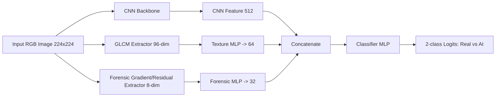
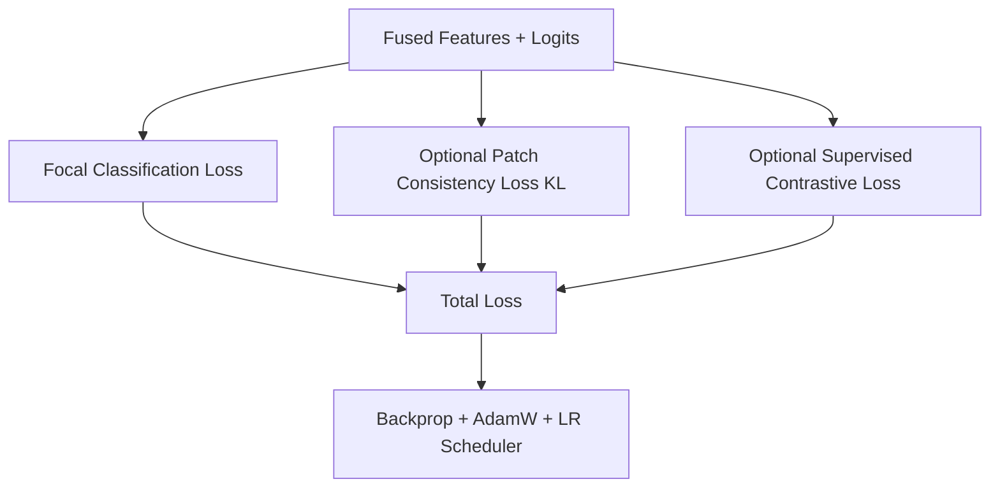

# Tandem Model Suite for Real vs AI Image Detection

This folder contains a three-run tandem modeling study and an inference notebook that compares all trained variants.

The tandem idea is to fuse:
- A CNN visual branch
- A handcrafted GLCM texture branch
- A lightweight forensic gradient/residual branch

This README is based on saved artifacts and persisted notebook outputs only (no notebook execution).

## Contents

- [Project Snapshot](#project-snapshot)
- [Model Family](#model-family)
- [Architecture](#architecture)
- [Training Setup](#training-setup)
- [Inference/Evaluation Protocol](#inferenceevaluation-protocol)
- [Saved Results (All 3 Models)](#saved-results-all-3-models)
- [Training Dynamics from Checkpoint Histories](#training-dynamics-from-checkpoint-histories)
- [What Worked](#what-worked)
- [What Did Not Work Well](#what-did-not-work-well)
- [Caveats and Reliability Notes](#caveats-and-reliability-notes)
- [Artifacts in This Folder](#artifacts-in-this-folder)
- [Repro/Usage Notes](#reprousage-notes)
- [Recommended Next Steps](#recommended-next-steps)

## Project Snapshot

There are three trained tandem variants:
- `model_1_baseline`: baseline classifier only
- `model_2_patch`: baseline + patch consistency regularization
- `model_3_contrast`: baseline + supervised contrastive term

Persisted inference output shows all three checkpoints load successfully and are evaluated side-by-side.

## Model Family

Core model class: `CNNWithTextureFusion`

Shared structure across variants:
- CNN branch: stacked residual conv blocks + final conv head + global average pooling
- Texture branch: MLP over 96-dim GLCM vector
- Forensic branch: MLP over 8-dim forensic gradient/residual vector
- Fusion: concatenation of `[cnn_feat(512), glcm_feat(64), forensic_feat(32)]` into a classifier head

Variant-specific training objectives:
- Baseline: focal classification loss
- Baseline+patch: focal + patch-view consistency KL term
- Baseline+contrast: focal + supervised contrastive loss on projected fused features

## Architecture

### High-level Model Diagram

### Exact GLCM Extraction Configuration

The texture branch uses the same deterministic GLCM setup as in
`tandam_model.ipynb`:

- Input window size: full resized grayscale image `224 x 224` (global window; no sliding local patch window)
- Quantization levels: `64`
- Distances: `[1]` pixel
- Angles (radians): `[0, pi/8, pi/4, 3pi/8, pi/2, 5pi/8, 3pi/4, 7pi/8]`
  (equivalently in degrees: `[0, 22.5, 45, 67.5, 90, 112.5, 135, 157.5]`)
- GLCM options: `symmetric=True`, `normed=True`

From each angle-specific GLCM, 12 scalar texture statistics are computed and
concatenated across 8 angles to produce the 96-dimensional input to the texture MLP.

### Training-Time Objective Diagram

## Training Setup

From `tandam_model.ipynb`:

- Dataset: Hugging Face `ShreyashDhoot/Ai-vs_Real`
- Image size: 224
- Batch size: 32
- Optimizer: AdamW
- Epoch budget in config: 12
- LR: `7e-4`
- Weight decay: `2e-4`
- Classification loss: Focal loss (`gamma=2.0`) with class weights
- Patch consistency weight: `0.2`
- Contrastive weight: `0.1`
- Contrastive temperature: `0.07`
- Gradient clipping: max norm `2.0`
- LR scheduler: ReduceLROnPlateau

Handcrafted features:
- GLCM: 12 features x 8 angles = 96 dimensions
- Forensic: 8 dimensions (gradient PCA + residual stats)

## Inference/Evaluation Protocol

From persisted `tandam_inference_three_models.ipynb` output:

- Dataset loaded in streaming mode from `ShreyashDhoot/Ai_vs_Real`
- Class-balanced sample size: 500 total
- Split: 50/50 into validation (threshold tuning) and test (reporting)
- Per-model threshold selected on validation set by max F1
- Reported metrics:
  - Accuracy
  - Precision, Recall, F1
  - Balanced Accuracy
  - MCC
  - ROC-AUC
  - PR-AUC
  - Brier score
  - Confusion matrices

## Saved Results (All 3 Models)

The following are persisted test-set metrics from the inference notebook output block.

| Run ID | Variant | Threshold | Test Acc | Test Precision | Test Recall | Test F1 | Test Bal Acc | Test MCC | Test ROC-AUC | Test PR-AUC | Test Brier |
|---|---|---:|---:|---:|---:|---:|---:|---:|---:|---:|---:|
| model_1_baseline | baseline | 0.5018 | 0.7120 | 0.6609 | 0.8984 | **0.7616** | 0.7074 | **0.4508** | **0.7914** | **0.7682** | **0.1993** |
| model_2_patch | baseline+patch | 0.5191 | 0.6640 | 0.6310 | 0.8281 | 0.7162 | 0.6600 | 0.3406 | 0.7383 | 0.7131 | 0.2194 |
| model_3_contrast | baseline+contrast | 0.4463 | 0.6520 | 0.6120 | 0.8750 | 0.7203 | 0.6465 | 0.3307 | 0.7090 | 0.7054 | 0.2201 |

Ranking by persisted `test_f1`:
1. `model_1_baseline` (0.7616)
2. `model_3_contrast` (0.7203)
3. `model_2_patch` (0.7162)

Persisted notebook message explicitly reports:
- `Best model by test_f1: model_1_baseline`

## Training Dynamics from Checkpoint Histories

### model_1_baseline history (`model_1_baseline_history.json`)

- Recorded epochs: 11
- Best saved validation accuracy in history: `0.6960` (epoch 11)
- Validation loss trends down from `0.1397` to `0.1253`
- Train accuracy rises from `0.5857` to `0.6730`

### model_2_patch history (`model_2_patch_history.json`)

- Recorded epochs: 5
- Best saved validation accuracy in history: `0.6467` (epoch 5)
- Validation loss trends down from `0.1441` to `0.1370`
- Train accuracy rises from `0.5706` to `0.6215`

### model_3_contrast history (`model_3_contrast_history.json`)

- Recorded epochs: 3
- Best saved validation accuracy in history: `0.6600` (epoch 3)
- Validation loss around `0.1414 -> 0.1420 -> 0.1407`
- Train accuracy rises from `0.5732` to `0.6078`

Stored summary file exists for contrast run:
- `model_3_contrast_summary.json`

## What Worked

- Multibranch fusion itself works and all checkpoints are loadable for side-by-side comparison.
- Baseline variant delivered the strongest general metrics on the persisted test split:
  - Best F1
  - Best MCC
  - Best ROC-AUC
  - Best PR-AUC
  - Best Brier
- Threshold tuning on validation set is beneficial because all three models operate in high-recall, lower-precision regime.
- Recall is consistently high across all variants (`~0.83` to `~0.90` on test), which may be useful for screening-style use cases.

## What Did Not Work Well

- Extra regularizers (patch consistency, supervised contrastive) did not improve test F1 over baseline in the persisted run.
- Both augmented variants show lower calibration quality (higher Brier), lower MCC, and lower ROC/PR AUC than baseline.
- Patch and contrast variants are more false-positive heavy on the test confusion matrices (lower Real-class hit rate).
- Training-history fields `train_precision`, `train_recall`, `val_precision`, and `val_recall` are all saved as `0.0` in checkpoint history JSONs, indicating those specific logged values are not trustworthy as-is.

## Caveats and Reliability Notes

- Inference notebook uses a streaming sample of 500 images, not a full fixed benchmark split. Results are useful but not final.
- The sample is class-balanced by design; real deployment prevalence may differ.
- Thresholds are tuned on validation and reused on test within the same sampled pool; a fully external holdout is still needed.
- Feature-importance section was not successfully executed in the saved notebook state due to execution-order/kernel-state issue:
  - `NameError: name 'GLCM_ANGLES' is not defined`
- One saved summary JSON exists only for model 3; model 1 and 2 summary JSON outputs are missing, though their histories and weights are present.
- Label name fallback in code may map labels as `{0: "AI", 1: "Real"}` while confusion matrix headers print `Real/AI`; verify label semantics carefully before publication.
- Checkpoint loading is intentionally `strict=False`, and inference logs mention potential ignored unexpected keys from training-only heads.

## Artifacts in This Folder

- Training notebook: `tandam_model.ipynb`
- Inference notebook: `tandam_inference_three_models.ipynb`
- Checkpoints:
  - `checkpoints_tandem/model_1_baseline_best.pth`
  - `checkpoints_tandem/model_2_patch_best.pth`
  - `checkpoints_tandem/model_3_contrast_best.pth`
- Histories:
  - `checkpoints_tandem/model_1_baseline_history.json`
  - `checkpoints_tandem/model_2_patch_history.json`
  - `checkpoints_tandem/model_3_contrast_history.json`
- Summary currently present:
  - `checkpoints_tandem/model_3_contrast_summary.json`

## Repro/Usage Notes

- To inspect exact saved outputs without re-running heavy cells, open `tandam_inference_three_models.ipynb` and review executed cell outputs.
- The notebook includes fallback checkpoint path handling for local and project-relative execution.
- If re-running in fresh kernel, execute cells in order; the feature-importance cell depends on earlier globals (`GLCM_ANGLES`, dataset stats, loaders, model dict).

## Recommended Next Steps

1. Add deterministic evaluation set (fixed IDs) and repeat all three variants.
2. Export summary JSON for all runs (`model_1_baseline_summary.json`, `model_2_patch_summary.json`) for symmetry.
3. Fix training-history precision/recall logging so history files reflect real epoch-level metrics.
4. Re-run feature-importance section end-to-end in a clean ordered kernel and persist top feature tables to CSV.
5. Calibrate probability outputs (temperature scaling or isotonic) and compare Brier + expected calibration error.
6. Add confidence intervals via bootstrap on test metrics.
